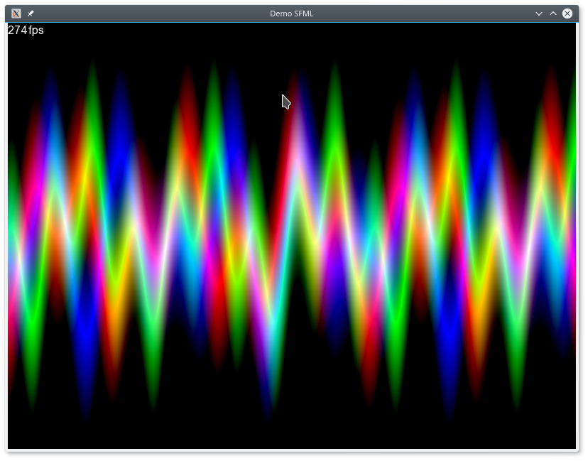

# SFML-DEMO
A simply SFML demonstration
### [Latest version here](https://github.com/ThKattanek/sfml-demo/releases)



## Used libraries
* SFML

## Compiling and installing
```bash
cd ~
git clone https://github.com/ThKattanek/sfml-demo.git
cd sfml-demo
mkdir build
cd build
cmake .. -DCMAKE_INSTALL_PREFIX=/usr/local
make
make install
```
## Compiling for Windows x32 with MXE (Crossdev)
```bash
cd ~
git clone https://github.com/ThKattanek/sfml-demo.git
cd sfml-demo
mkdir build-win-x32
cd build-win-x32
[MXE-PATH]/usr/bin/i686-w64-mingw32.static-cmake .. -DSFML_STATIC_LIBRARIES=TRUE
make
```
## Compiling for Windows x64 with MXE (Crossdev)
```bash
cd ~
git clone https://github.com/ThKattanek/sfml-demo.git
cd sfml-demo
mkdir build-win-x64
cd build-win-x64
[MXE-PATH]/usr/bin/x86_64-w64-mingw32.static-cmake .. -DSFML_STATIC_LIBRARIES=TRUE
make
```
## Complete build and create the windows versions (32/64bit) as 7zip with Script (crossbuild_win_releases.sh)
```bash
cd ~
git clone https://github.com/ThKattanek/sfml-demo.git
cd sfml-demo
./crossbuild_win_releases.sh [MXE-PATH]
```
The Script creates 4 folders ...

* build_win_32bit
* build_win_64bit
* install_win_32bit
* install_win_64bit

In the both folders install_win is the new 7zip package for windows.

### [MXE Website](http://mxe.cc)
